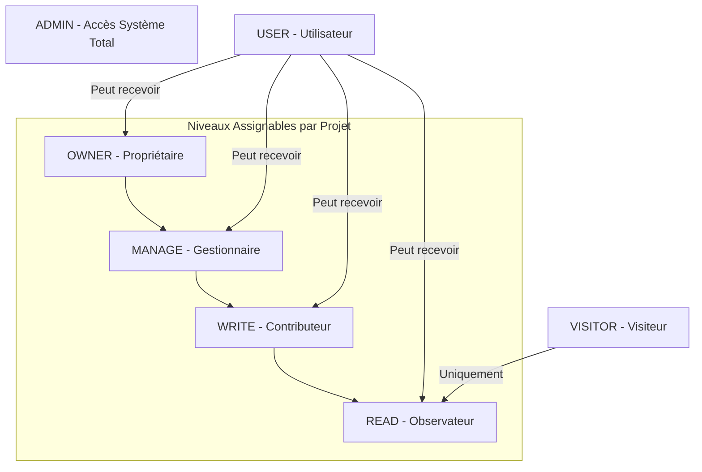

# Guide des Rôles et Autorisations - Matière

Ce document récapitule la structure des droits d'accès et les responsabilités au sein de l'application **Matière**.

## 1. Rôles Étendus (Système)

Le rôle global détermine les capacités générales de l'utilisateur sur l'ensemble de la plateforme.

| Rôle | Description | Responsabilités & Droits |
| :--- | :--- | :--- |
| **ADMIN** | Administrateur Système | Accès total à tous les projets, tous les médias et tous les réglages. Peut gérer les utilisateurs et les autorisations de tout le monde. |
| **USER** | Utilisateur Standard | Peut posséder des projets. Accès aux projets dont il est propriétaire ou pour lesquels il a reçu une autorisation explicite. |
| **VISITOR** | Visiteur | Accès restreint. Ne peut avoir que des droits de lecture sur les projets. Interface simplifiée (accès restreint aux documents PDF). |

---

## 2. Niveaux d'Autorisation par Projet

Pour les utilisateurs (**USER**) et les visiteurs (**VISITOR**), l'accès à un projet spécifique dépend du niveau d'autorisation accordé.

| Niveau | Label | Droits associés |
| :--- | :--- | :--- |
| **READ** | Lecture | Consulter le projet, voir les cartes et les médias (photos, PDF). |
| **WRITE** | Écriture | Droits de lecture + modification des détails du projet et ajout de nouveaux médias. |
| **MANAGE** | Gestion | Droits d'écriture + suppression de médias et gestion des autorisations pour ce projet. |
| **OWNER** | Propriétaire | Identique à **MANAGE**, mais définit l'utilisateur comme le responsable principal du projet. |

---

## 3. Détail des Composants du Dashboard

L'interface est décomposée en plusieurs "cards" dont le comportement et la visibilité varient selon les droits.

### A. Cartes de Localisation (Globale & Projet)
- **Visibilité** : Tous les rôles.
- **Interactions** : Sélection de projet par clic sur marqueur, zoom, changement de vue.

### B. Détails & Avancement (Description & Progress)
- **Visibilité** : Tous les rôles.
- **Contenu** : Description technique, Drapeau du pays, Logo du Client, Barres de progression (Prospection, Études...).
- **Modification** : Niveau **WRITE** ou supérieur requis. Boutons masqués pour les autres.

### C. Galerie Média (Photos & Vidéos)
- **Visibilité** : Tous les rôles.
- **Interactions** : Ouverture en plein écran (Lightbox), lecture vidéo.
- **Gestion** : Niveau **WRITE** ou supérieur requis pour ajouter ou modifier des photos via l'outil de traitement d'images.

### D. Tableau de Synthèse (Results Table)
- **Visibilité** : Tous les rôles.
- **Interactions** : Tri, filtrage rapide, sélection de projet.
- **Export PDF** : Bouton d'export du rapport technique **masqué pour les VISITORS**.

### E. Documents & Plans (PDF)
- **Visibilité** : **Masqué pour les VISITORS**. Accessible pour les autres rôles.
- **Fonction** : Lecteur PDF intégré pour consulter les plans techniques et documents contractuels.

---

## 4. Gestion des Autorisations
- Les **ADMINS** ont un accès total pour attribuer, modifier ou révoquer des accès pour n'importe quel projet.
- Les **USERS** (incluant OWNER et MANAGE) ont un accès en **LECTURE SEULE** à cette page pour consulter les permissions de leurs projets.
- Les **VISITORS** n'ont aucun accès à cette page.
- **Note** : Les administrateurs sont filtrés des listes de gestion car ils possèdent déjà tous les droits par défaut.

---

---

## 5. Matrice Visuelle des Droits

### Diagramme de Hiérarchie

### Table Récapitulative des Capacités

Ce tableau combine le **Rôle Global** et le **Niveau de Permission** sur un projet.

| Capacité | VISITOR | USER (READ) | USER (WRITE) | USER (MANAGE) | USER (OWNER) | ADMIN |
| :--- | :--- | :---: | :---: | :---: | :---: | :---: |
| **Dashboard** : Cartes & Détails | ✅ | ✅ | ✅ | ✅ | ✅ | ✅ |
| **Dashboard** : Galerie Photos | ✅ | ✅ | ✅ | ✅ | ✅ | ✅ |
| **Dashboard** : Tableau Synthèse | ✅ | ✅ | ✅ | ✅ | ✅ | ✅ |
| **Dashboard** : Documents PDF | ❌ | ✅ | ✅ | ✅ | ✅ | ✅ |
| **Dashboard** : Export PDF | ❌ | ✅ | ✅ | ✅ | ✅ | ✅ |
| **Action** : Modifier détails projet | ❌ | ❌ | ✅ | ✅ | ✅ | ✅ |
| **Action** : Visibilité (Public/Privé) | ❌ | ❌ | ✅ | ✅ | ✅ | ✅ |
| **Action** : Gestion Photos (R2) | ❌ | ❌ | ✅ | ✅ | ✅ | ✅ |
| **Action** : Supprimer des photos | ❌ | ❌ | ❌ | ✅ | ✅ | ✅ |
| **Ressources** : Gérer permissions | ❌ | ❌ | ❌ | ❌ | ❌ | ✅ |
| **Ressources** : Changer propriétaire| ❌ | ❌ | ❌ | ❌ | ❌ | ✅ |
| **Système** : Configuration site | ❌ | ❌ | ❌ | ❌ | ❌ | ✅ |

---

## 6. Résumé Technique des Responsabilités

- **Administrateur (ADMIN)** : Gardien du système. Bypass toutes les vérifications de permissions par projet.
- **Propriétaire (OWNER)** : Responsable du projet (généralement celui qui l'a créé).
- **Gestionnaire (MANAGE)** : Responsable adjoint, peut gérer l'équipe du projet.
- **Contributeur (WRITE)** : Profil opérationnel, met à jour les données du terrain.
- **Observateur (READ)** : Consultatif (Client ou Partenaire).
- **Visiteur (VISITOR)** : Profil externe avec visibilité restreinte aux photos et cartes (PDF masqués).
